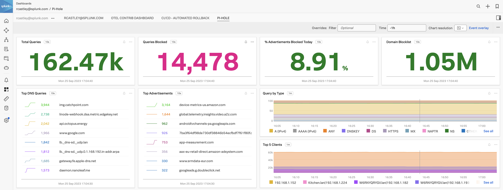

# Monitoring Pi-hole Using Pi-hole Exporter and OpenTelemetry: A Comprehensive Guide

## Introduction

Pi-hole is a fantastic open-source DNS-based ad blocker that enhances your online experience by blocking unwanted ads and trackers network-wide. Monitoring the performance and status of your Pi-hole setup is essential to ensure its effectiveness. In this blog post, we'll explore how to use the Pi-hole Exporter to collect and visualize metrics from your Pi-hole installation, enabling you to monitor and optimize its performance effortlessly.

## Prerequisites

Before we dive into monitoring Pi-hole with the Pi-hole Exporter, make sure you have the following prerequisites:

1. **Pi-hole Installed**: You should have Pi-hole up and running on a Raspberry Pi or another supported device. If you haven't installed Pi-hole yet, you can find instructions on the [Pi-hole website](https://pi-hole.net/).

2. **Docker (Optional)**: To simplify the setup process, consider installing Docker on the machine where you plan to run the Pi-hole Exporter. Docker makes it easy to run containers without worrying about dependencies.

## Step 1: Install Pi-hole Exporter

The Pi-hole Exporter is a Prometheus exporter specifically designed to collect and expose metrics from your Pi-hole instance. You can run it as a Docker container or directly from the CLI. Here's how to do it:

1. For Docker run the following command:

   ``` bash
   docker run \
    -e 'PIHOLE_HOSTNAME=pihole_ip_address' \
    -e 'PIHOLE_PASSWORD=mypassword' \
    -e 'PORT=9617' \
    -p 9617:9617 \
    ekofr/pihole-exporter:latest
   ```

2. For the CLI download the latest version (`v0.4.0` at the time of writing) [https://github.com/eko/pihole-exporter/releases/download/v0.4.0/pihole_exporter-linux-arm](https://github.com/eko/pihole-exporter/releases/download/v0.4.0/pihole_exporter-linux-arm)

   ``` bash
   ./pihole_exporter -pihole_hostname pi-hole_ip_address -pihole_password mypassword &
   ```

   Replace `pi-hole_ip_address` and `mypassword` with the actual IP address or hostname and administration password of your Pi-hole installation.

The Pi-hole Exporter is now running, collecting metrics from your Pi-hole instance, and exposing them on port 9617.

## Step 2: Install and Configure OpenTelemetry to Scrape Metrics

To scrape the metrics collected by the Pi-hole Exporter, we'll use OpenTelemetry. My PiHole is currently running RaspianOS 32bit (Debian 10), so the `armv7` version of OpenTelemetry is required [https://github.com/open-telemetry/opentelemetry-collector-releases/releases/download/v0.85.0/otelcol_0.85.0_linux_armv7.deb](https://github.com/open-telemetry/opentelemetry-collector-releases/releases/download/v0.85.0/otelcol_0.85.0_linux_armv7.deb). Ensure you download and install the correct version for your operating system.

1. Install OpenTelemetry

   ``` bash
   sudo dpkg -i otelcol_0.85.0_linux_armv7.deb
   ```

2. Edit the OpenTelemetry configuration to scrape the Pi-hole Exporter Prometheus endpoint. For this we need to create a new receiver:

   ``` yaml
   # Collect Pi-Hole Exporter metrics
   prometheus/pi-hole:
     config:
       scrape_configs:
       - job_name: 'pi-hole-exporter'
         scrape_interval: 10s
         static_configs:
         - targets: ['localhost:9617']
   ```

3. In the metrics pipeline add the newly created reciever:

   ``` yaml
   metrics:
     receivers: [otlp, opencensus, prometheus, prometheus/pi-hole]
   ```

4. Restart OpenTelemetry to apply the changes and check the logs to ensure there are no errors.

5. Next, we need to configure where we are going to send our new metrics, Splunk Observability Cloud is a fantastic choice. If you don't have a Splunk Observability Cloud account, you can sign up for a free trial [here](https://www.splunk.com/en_us/software/observability.html). So, we need to define the metrics ingest endpoint, realm and access token using an OTLPHTTP exporter. Also, when creating the new exporter it is a good idea to change the `logging` exporter value from `detailed` to `normal` otherwise the logs are very, very noisy.

   ``` yaml
   exporters:
     logging:
       verbosity: normal
     otlphttp/splunk:
       metrics_endpoint: https://ingest.${REALM}.signalfx.com/v2/datapoint/otlp
       headers:
         X-SF-TOKEN: ${ACCESS_TOKEN}
   ```

   **Note:** The varilables `${REALM}` and `${ACCESS_TOKEN}` can be configured and set in `/etc/otelcol/otelcol.conf`.

   Of course, the exporter could be any Observability endpoint, so if you wish to use something else, then please configure for that environment accordingly.

6. Finally, add the newly created exporter to the metrics pipeline, your final metrics pipeline configuration should now look like this:

   ``` yaml
    metrics:
      receivers: [otlp, opencensus, prometheus, prometheus/pi-hole]
      processors: [batch]
      exporters: [logging, otlphttp/splunk]
   ```

## Step 3: Visualize Metrics with Splunk Observability Cloud (Optional)

Now that we've set up the Pi-hole Exporter and OpenTelemetry, we can visualize the metrics in Splunk Observability Cloud.

You can use the following dashboard to visualize the metrics collected by the Pi-hole Exporter and OpenTelemetry which is available to import into Splunk Observability Cloud which can be found [here](https://raw.githubusercontent.com/rcastley/monitoring_pihole/main/dashboard_Pi-Hole.json).

For more information on how to import a new dashboard into an existing dashboard group, see [here](https://docs.splunk.com/Observability/en/data-visualization/dashboards/dashboards-import-export.html).



## Conclusion

Monitoring Pi-hole with the Pi-hole Exporter and OpenTelemetry offers valuable insights into the performance and status of your ad-blocking service.

By following this comprehensive guide, you can set up the OpenTelemetry to collect metrics from your Pi-hole installation easily. Sending the metrics to Splunk Observability Cloud enables you to visualize and analyze these metrics effectively, ensuring your Pi-hole operates optimally and enhances your online experience by blocking unwanted ads and trackers.

Whether you're a home user or a network administrator, monitoring Pi-hole with these tools is a powerful way to maintain a clean and efficient network.
